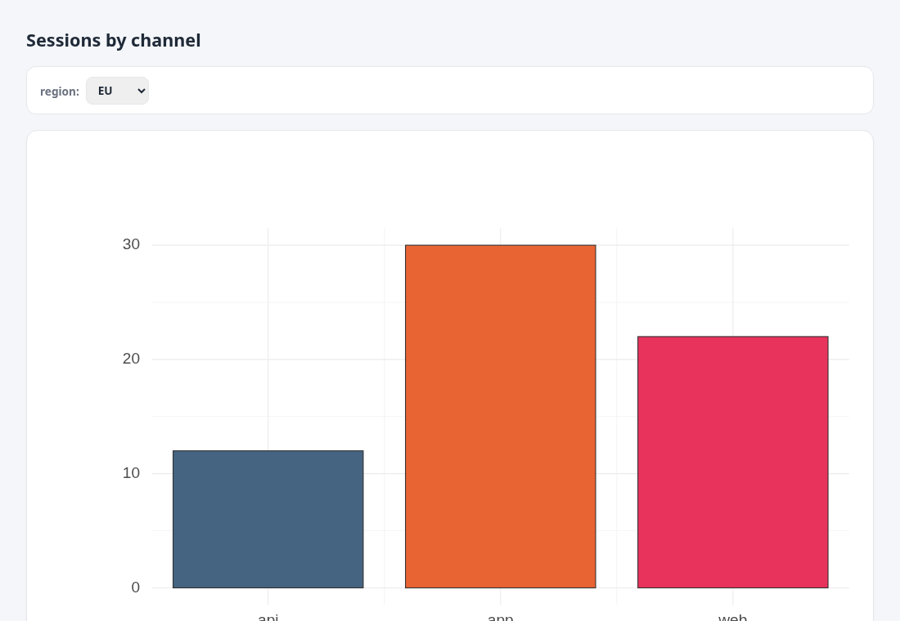
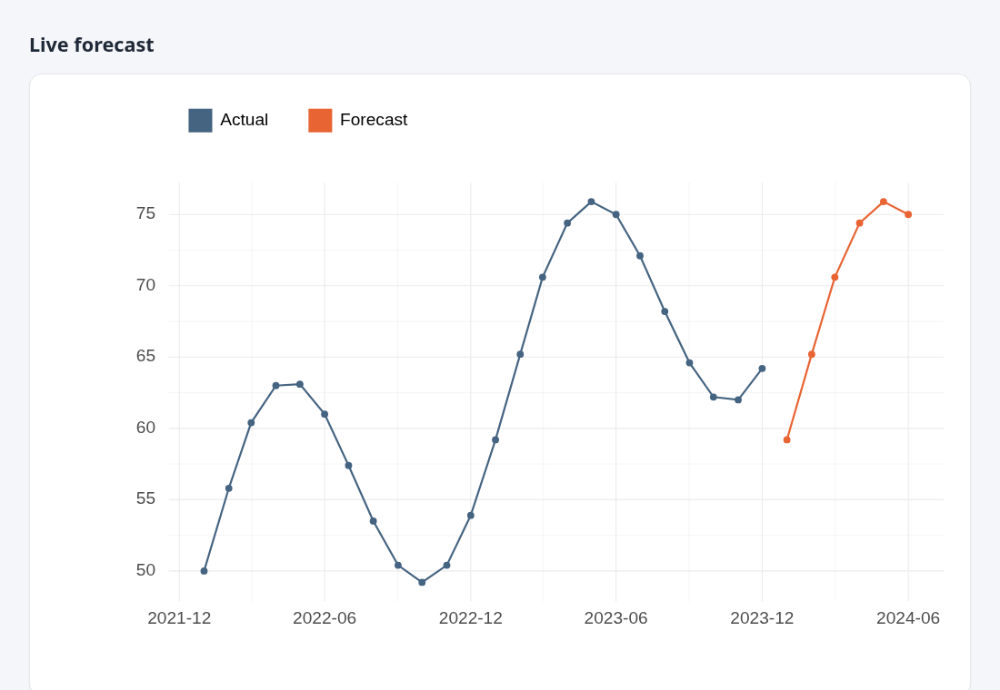

# Secure multi-user serving — design & plan

**Goal.** Serve a fixed, live dashboard to *untrusted* consumers: they see
current data, but they cannot run arbitrary SQL or reach anything beyond the
dashboard they were given.

This document is the plan to get from today's single-developer serving to that.

## Status

Two serving implementations exist, **both read-only**. Pick by whether consumers
need the interactive UI (A) or just a static picture (B).

### A. Gated full-UI serving — the extension

`SELECT anofox_serve_dashboards('<dir>', <port>);` serves the *real* browser
client, locked down: the editor is removed and `POST /query` is **gated** to the
panel SQL each dashboard declares (an `sql::plan` allow-list) plus validated
`SET VARIABLE`s — anything else is `403`. So consumers get the whole feature set
(charts, rich tables, KPIs, inputs, hover) without the client being able to run
arbitrary SQL.

- ✅ **Server owns the SQL** — allow-list built from the checked-in `.sql`; a
  request that isn't a registered panel query (or a valid `SET VARIABLE`) → `403`.
- ✅ **Read-only, by construction** — `access_mode` can't be flipped at runtime
  and a read-only `ATTACH` would leave the original DB reachable by qualified
  name, so at startup it **snapshots the live database to a temp file** (`COPY
  FROM DATABASE`) and serves through a **fresh read-only DuckDB handle** with no
  writable database attached. Even a gate bypass can't write — *verified*: an
  allow-listed `INSERT` is rejected `"… attached in read-only mode"`.
- ✅ **Multi-user safe** — each request is self-contained (the client inlines its
  own input variables), so concurrent viewers never clobber one another's state.
- ✅ **Multi-page** — `::TAB`/`::PAGE` are pages within a dashboard; a folder of
  `.sql` files is a linked set, served with a shared **cross-dashboard nav bar**
  and `?tab=` **deep-links** (a reload / shared link restores the page).
- ⬜ **Least-privilege scoping** — it snapshots the *whole* current database; a
  dedicated read-only view-scoped source is still the operator's job (point it at
  a database that only exposes the dashboards' views).
- ⬜ **Auth + TLS** — deployment; put a reverse proxy in front.
- **Caveat:** it serves the snapshot taken at startup — re-run
  `anofox_serve_dashboards` to refresh (per-request refresh on the read-only
  handle is a follow-up).

### B. Static server-side render — the `serve` bin

`serve --dashboards <dir> [--init setup.sql]` — the most locked-down option: **no
client `/query` at all**, server-side SVG only. Consumers pick a dashboard id and
whitelisted params.

- ✅ **Server owns the SQL** — id + parameter *values* only; no client SQL.
- ✅ **Whitelisted params** — declared per dashboard (`-- @param region [EU, US]
  = EU`); a value outside the list is rejected with `400`.
- ✅ **Read-only queries** — runs `duckdb --readonly`.
- ✅ **Result caching** — `--cache <seconds>` shares one render across N viewers
  of the same view and doubles as the freshness knob. Off by default.
- ⬜ **Full capability lockdown** — a dedicated read-only role / disabling
  `ATTACH`/file reads is the operator's job via `--init` + DuckDB config.
- ⬜ **Auth + TLS** — deployment; put a reverse proxy in front.

Try B: `serve --dashboards examples/serve-dashboards/dash --init
examples/serve-dashboards/init.sql` → open `http://127.0.0.1:8080/`.

The authoring mode (`anofox_serve` — embedded builder + free-form `/query`) is
unchanged and localhost-only.

---

## Where we are today (v0 — authoring mode)

`SELECT anofox_serve(port)` starts an in-process HTTP server that:

- serves the **full builder** (with the SQL editor), and
- exposes `POST /query`, which runs **whatever SQL the client sends** against the
  live DuckDB session.

This is great for the author on `localhost`, and we keep it — but renamed in
intent to **admin / authoring mode**. It is *not* safe to expose to untrusted
consumers: the client controls the SQL. "View-only" (`?embed=1`) only hides the
editor in the UI; it is presentation, not an access boundary.

---

## What it looks like

Rendered server-side from a **read-only DuckDB** — no editor, no client SQL.

A parameterised dashboard (the `region` dropdown is whitelisted; the server runs
the fixed query):

A live forecast — `ts_forecast_by(...)` runs inline, read-only, per request
(`-- @load anofox_forecast`), bounded by `--cache`:

## Target (v1 — serve mode)

Three changes, in priority order. **Note:** #1 (server owns the SQL) and #2
(read-only) are **already delivered** by the gated extension mode (A) above —
via an allow-listed `/query` plus a read-only snapshot, rather than the
per-panel-endpoint design sketched below. That design remains a valid
alternative; the remaining real gaps are **least-privilege view-scoping** and
**#3 (auth + TLS)**.

### 1. The server owns the SQL (the architectural flip)

The single most important change. The client stops sending SQL; it selects a
**dashboard** and supplies **whitelisted parameters**.

- **Register dashboards server-side.** A dashboard is
  `{ id, title, panels: [ { id, sql_template, params } ], refresh }`. Each
  `sql_template` is the annotated (`::ROLE`) SQL, fixed at registration, with
  only typed `:param` placeholders.
  - Source: a directory of `.sql` files loaded at startup, and/or
    `CALL anofox_register_dashboard('sales', $$ … $$)`.
  - The server parses/plans each template **once**.
- **Endpoints (no SQL crosses the wire):**
  - `GET  /d/<id>` → the view-only dashboard shell (no editor).
  - `POST /d/<id>/panel/<n>` with a JSON body of **only** declared params →
    the server binds them and returns the rendered SVG (or rows).
  - `GET  /d` → list of dashboards the caller may see.
- **Parameters are typed + whitelisted** (enum of allowed values, or a numeric
  range/date window) and **bound as query parameters** — never string-
  concatenated — so there is no injection surface. A param that isn't declared
  is rejected.

Result: a consumer can pick `region=EU` from a dropdown, but cannot change the
query, add a column, `ATTACH`, read a file, or reach another table.

### 2. Read-only, least-privilege connection

Defence in depth, so even a bug in param handling is bounded.

- Serve from a DuckDB connection that can only **read the specific views** the
  dashboards expose (not base tables): `CREATE VIEW dash_sales AS SELECT … ;`
  and grant/scope to those.
- Lock the session down: no `ATTACH`/`INSTALL`/`COPY`/file reads
  (`SET enable_external_access = false;`, disable the relevant functions), and
  run the process as an OS user with no filesystem access beyond what it needs.
- For MotherDuck/Postgres, use a **read-only role** on the upstream too.

### 3. Auth + TLS (deployment)

- Bind address is configurable (default `127.0.0.1`; opt in to `0.0.0.0` only
  behind a proxy).
- Terminate **TLS + authentication at a reverse proxy** (nginx / Caddy /
  Cloudflare) in front of the serving process.
- Optional: signed dashboard links or per-consumer tokens for finer access.

---

## Three modes

| | **Admin / authoring** | **Gated serve (A)** | **Static serve (B)** |
|---|---|---|---|
| Entry | `anofox_serve(port)` | `anofox_serve_dashboards(dir, port)` | `serve --dashboards <dir>` |
| UI | full builder + editor | real client, editor removed | server-side SVG only |
| SQL source | free-form `/query` | **allow-listed** `/query` (panel SQL + `SET VARIABLE`) | id + whitelisted params only |
| DB connection | read-write session | **read-only snapshot** | `duckdb --readonly` |
| Multi-page / nav | n/a | tabs + folder + shared nav + `?tab=` | one dashboard per URL |
| Bind / auth | localhost, dev token | proxy + TLS + auth | proxy + TLS + auth |
| Audience | the author | untrusted consumers (interactive) | untrusted consumers (static) |

Admin mode stays for development; A and B are what you expose to consumers.

---

## Freshness & concurrency

- Each panel request runs its stored query on the live read-only connection → the
  data is always current.
- Add **per-panel result caching with a TTL** so N consumers refreshing don't
  become N× load on the upstream DB; the TTL doubles as the freshness knob.
- Bake a default **auto-refresh interval** into the served dashboard.

---

## Where it should live

Today the server is embedded in the DuckDB extension. For v1, a **small
standalone service** (the core renderer + a DuckDB connection it owns + the HTTP
layer above) is cleaner than a server inside an extension, and it can `ATTACH`
MotherDuck/PostgreSQL itself. The extension keeps `anofox_serve` for local
authoring.

---

## Steps

1. Split `anofox_serve` into **admin** vs **serve** modes; move free-form
   `/query` behind admin + localhost + a token.
2. **Dashboard registry** — parse annotated SQL → stored plan + declared params
   (from `.sql` files and/or a `register` call).
3. **Typed param binding** — whitelist + bind as query params; reject unknowns.
4. `GET /d/<id>` view-only shell + `POST /d/<id>/panel/<n>` param endpoint.
5. **Read-only, view-scoped connection** + capability lockdown.
6. **Deployment guide** — reverse proxy (TLS/auth), bind address; optional
   result caching + default refresh interval.

Step 1 removes the immediate footgun (free-form SQL on a network-exposed port);
steps 2–4 are the server-owns-the-SQL flip; 5–6 harden and productionize.
