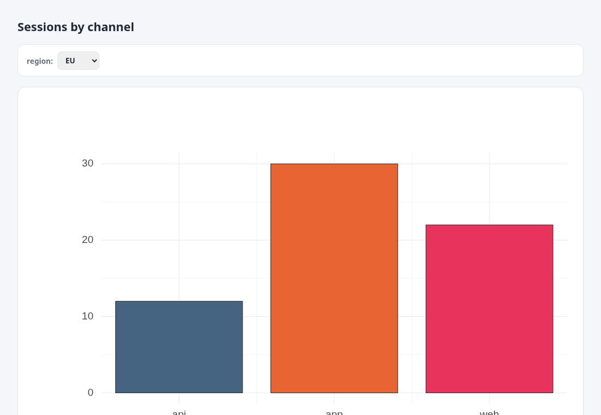

# Secure serving — trust model

**Goal.** Serve a fixed, live dashboard to *untrusted* consumers: they see
current data, but they cannot run arbitrary SQL or reach anything beyond the
dashboard they were given — while the author keeps a convenient authoring UI
that nobody else can drive.

There are three serving modes. Two run client SQL only for the author; the
other two never accept SQL from the client at all.

| | **Authoring** | **Locked, full UI (A)** | **Static render (B)** |
|---|---|---|---|
| Entry | `anofox_serve(port)` / `serve <db>` | `anofox_serve_dashboards(dir, port[, options])` | `serve --dashboards <dir>` |
| Audience | the author, on this machine | untrusted consumers (interactive) | untrusted consumers (static) |
| UI | full builder + editor | real client, editor removed | server-side SVG only |
| What the client sends | SQL (`POST /query`) | `{dashboard, panel, vars, page}` (`POST /api/panel`) — **no SQL** | dashboard id + whitelisted `?param=` values |
| Database | the live read-write session / file | private read-only snapshot, locked config | `duckdb -readonly`, locked config |
| Bind | loopback only (enforced) | `127.0.0.1` | `--bind` (default `127.0.0.1`) |
| Access control | loopback `Host`, same-origin, per-server token | same-origin `POST`; put auth/TLS in a proxy | put auth/TLS in a proxy |

Available in the **from-source build** only (`duckext/`, see
[`BUILD.md`](../BUILD.md)); the community extension is render-only.

---

## Authoring — `anofox_serve(port)` and `serve <db>`

Runs whatever SQL the builder sends, against your live data. That is the point,
so the protection is about making sure *only you* can send it:

- **Loopback only.** The extension always binds `127.0.0.1`; the `serve` bin
  refuses a non-loopback `--bind` in authoring mode.
- **Per-server token.** A random 128-bit token is generated at start. The URL
  that is printed (and opened) carries it once — `http://127.0.0.1:8080/?token=…`;
  the server answers with a redirect that stores it in an `HttpOnly;
  SameSite=Strict` cookie (`anofox_token_<port>`). Every request needs the
  cookie or an `X-Anofox-Token` header; otherwise `401`.
- **DNS rebinding.** The `Host` header must be a loopback name for this port
  (`127.0.0.1`, `localhost`, `[::1]`); anything else is `403`.
- **CSRF.** A request whose `Origin` differs from the `Host` it was sent to is
  `403` — including pages on *other* localhost ports (cookies are shared across
  ports, origins are not). A `text/plain` form/fetch POST from a web page
  therefore never reaches the SQL endpoint.
- **No CLI meta commands** (`serve` bin). It executes SQL through the `duckdb`
  CLI; a body (or `--init` script) containing a line that starts with `.` is
  refused, so `.shell`, `.read`, `.output`, … never reach the CLI.
- Body limit 4 MiB; authoring results are capped at 1,000,000 rows.

`SELECT anofox_serve_stop(port)` stops an extension server.

## A. Locked, full UI — `anofox_serve_dashboards(dir, port[, options])`

Serves the real browser client for every `.sql` file in `dir`
(`/` lists them, `/d/<id>` opens one; ids are restricted to `[A-Za-z0-9_.-]`).

**The server owns the SQL.** The dashboards are planned on the server at
startup; the client never sends SQL. To run statement *n* of dashboard *id* it
POSTs

```json
{"dashboard": "sales", "panel": 3, "vars": {"region": "EU"},
 "page": {"limit": 10, "offset": 20, "sort": "Region", "desc": false, "filter": "app"}}
```

- `vars` values must be JSON strings, numbers, booleans, `null` or flat lists of
  those; they become **typed SQL literals** (`'EU'`, `5`, `TRUE`, `['a','b']`) in
  `SET VARIABLE <name> = <literal>`; names must be identifiers. Objects, nested
  lists, NUL bytes and oversize values are rejected — there is no way to turn a
  value into an expression or a subquery.
- `page` (for `::PAGED` tables) is structural: the server builds the
  `COUNT(*)` / `ORDER BY` / `LIMIT` / `OFFSET` query itself; the sort column is
  quoted as an identifier and the full-text filter is bound as a
  **prepared-statement parameter**.
- Unknown fields, dashboards or panels are rejected (`400`/`404`). There is no
  `/query` endpoint (`410`).
- Every statement of every dashboard is checked with DuckDB's own parser at
  startup (exactly one statement each); panels execute as single prepared
  statements.

**Read-only, locked-down snapshot.** At startup the server copies the session's
databases (`COPY FROM DATABASE`) into a **private, randomly named `0700`
directory** and opens them in a **separate DuckDB instance**:

- every attached DuckDB database (not just the current one) is re-attached
  `READ_ONLY` under its original name; non-DuckDB catalogs (Postgres, SQLite, …)
  are *not* snapshotted and are reported as warnings — expose what you need
  through tables in a DuckDB database (pass `'{"attach": false}'` to snapshot only
  the current database);
- extensions loaded in the session, `-- @load <ext>` header lines and
  `options.load` are loaded first;
- then `enable_external_access = false` (no file or network access — `COPY … TO`,
  `read_text`/`read_csv`, `ATTACH`, `INSTALL`, `LOAD` are all refused), extension
  auto-install/auto-load and community extensions are off, and
  `lock_configuration = true`, so no statement can undo any of it;
- on unix the snapshot files are unlinked as soon as they are attached (the open
  handles keep working); the directory is removed when the server stops
  (`anofox_serve_stop`) or a start fails. On Windows the files remain until stop.

The snapshot is taken at startup: stop and re-start to refresh.

**Per-request isolation and limits.**

- A fresh connection per request: one viewer's variables or temp objects never
  leak into another's. Setup statements (`CREATE TEMP …`) of the dashboard are
  re-run per request; only TEMP objects can be created (the data is read-only),
  so materialise anything heavy before serving.
- Options (third argument, JSON): `max_rows` (default 100,000 — exceeding it is
  an error, not a silent truncation), `timeout_ms` (default 30,000 — enforced
  with `duckdb_interrupt` from a watchdog), `max_body_bytes` (default 64 KiB),
  `threads` (worker pool, default 4), `attach`, `load`.
- Cross-origin `POST`s are refused (CSRF).
- The injected page config is script-safe JSON (`<` is emitted as `<`),
  titles and ids are HTML-escaped.

```sql
SELECT anofox_serve_dashboards('dashboards', 8095,
  '{"max_rows": 50000, "timeout_ms": 10000, "threads": 8}');
SELECT anofox_serve_stop(8095);
```

## B. Static render — `serve --dashboards <dir>`

The most locked-down option: **no client data API at all**, server-side SVG only.
Consumers pick a dashboard id and whitelisted params
(`-- @param region [EU, US] = EU`; a value outside the list is `400`).

- Panels run `duckdb -readonly`; after the server-declared `-- @load`s, each
  session sets `enable_external_access = false` and `lock_configuration = true`.
- `--max-rows` (default 100,000), `--timeout` seconds (default 30; the CLI is
  killed), `--threads` (default 4), `--cache <seconds>` (shared render cache,
  doubles as the freshness knob).
- `--init setup.sql` runs once, read-write, before serving (attach sources,
  create views/tables). CLI dot-commands are refused there too.

Try it: `serve --dashboards examples/serve-dashboards/dash --init
examples/serve-dashboards/init.sql` → `http://127.0.0.1:8080/`.



---

## What remains the operator's job

- **Authentication + TLS** for consumer-facing modes: terminate both at a reverse
  proxy (nginx / Caddy / Cloudflare) in front of the server; bind the server to
  loopback and let only the proxy reach it.
- **Least privilege on the data**: the snapshot contains everything in the
  session's DuckDB databases. Serve from a session (or `--db`) that only holds
  the tables/views the dashboards need.
- **Variable values are not whitelisted in mode A**: a viewer can set any
  identifier-named variable to any literal. Panels see them only through
  `getvariable()`, so write panel SQL that treats variables as untrusted
  *values* (they cannot change the query's structure).
- **Process isolation**: run the server as an OS user without access to more
  than it needs.
